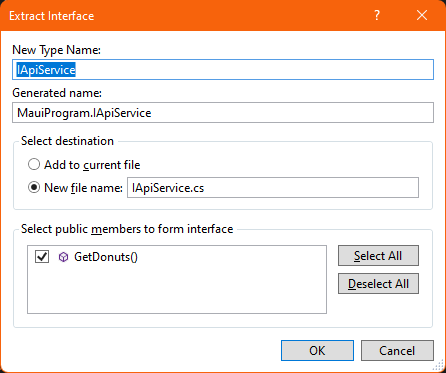
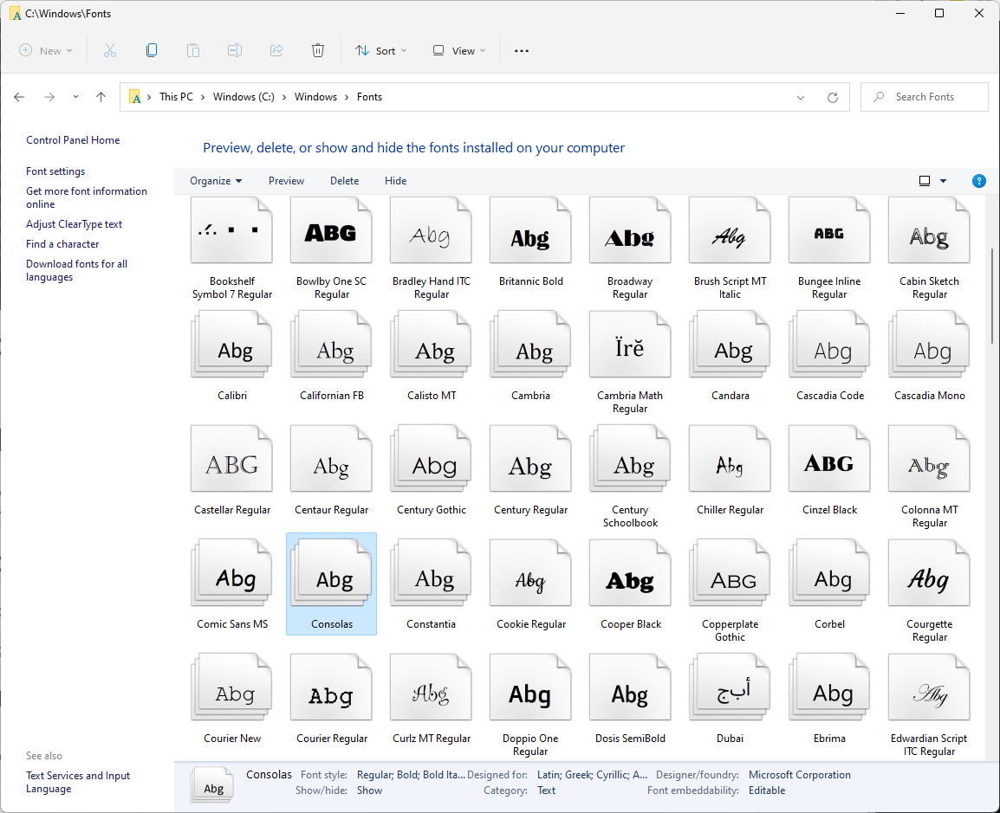
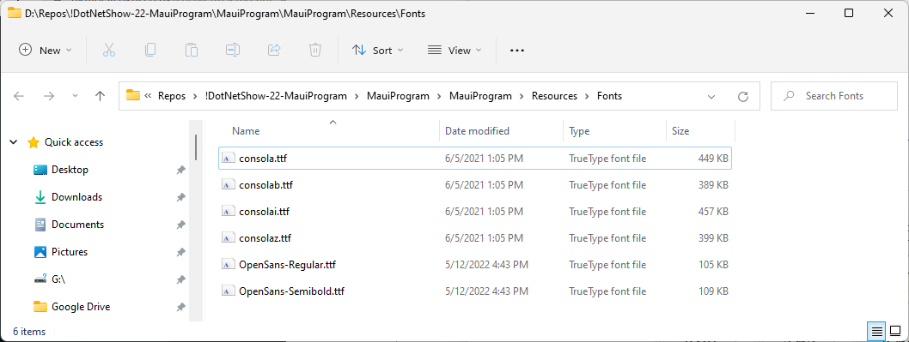
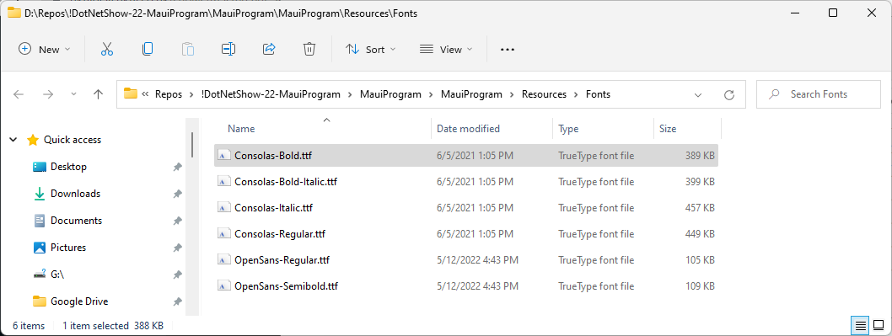
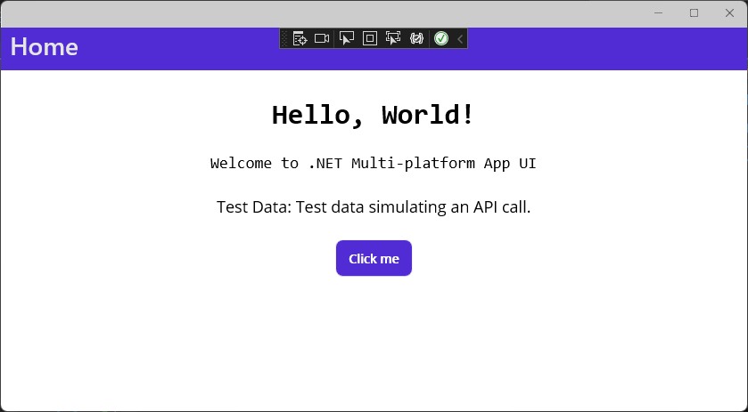
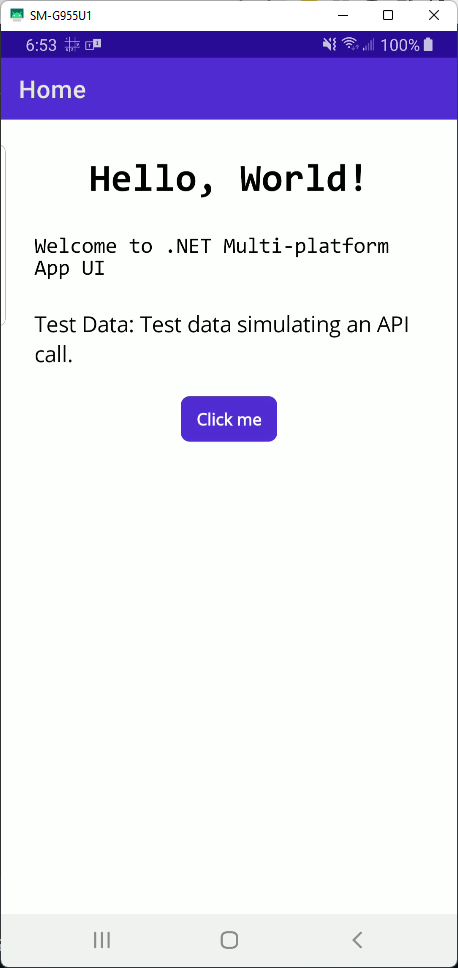

# MauiProgram.cs

In this module we are going to cover what is in the MauiProgram class, how does it work, why it works, and how can we configure services. In this episode we will focus on fonts and logging.

This is the repo for episode 22 of The .NET Show, which you can find at [https://thedotnetshow.com](https://thedotnetshow.com)

#### A New Discovery: SrcCpy

Before we get started, I need to tell you about a fairly new free open-source tool  that lets you view your Android screen on your Windows, Mac, or Linux desktop. There are download links and instructions at the repo. Go get it!

[https://github.com/Genymobile/scrcpy](https://github.com/Genymobile/scrcpy)

Run it at the command line so you can see any error messages.

I have my Android phone connected via USB, so I use this command:

```
scrcpy -d --select-usb
```

Here's a more helpful guide:

[https://www.makeuseof.com/tag/mirror-android-screen-pc-mac-without-root/](https://www.makeuseof.com/tag/mirror-android-screen-pc-mac-without-root/)


## MauiProgram

MAUI applications are bootstrapped using a _host_. The _host_ allows applications to be initialized from a single location, as well as configure services, libraries, resources, etc. just like in other .NET Core applications.

The _host_ also encapsulates app's resources, and lifetime like Dependency Injection, Logging, Configuration, and App shutdown.

In the case of MAUI applications, the specific _host_ utilized is a [.NET Generic Host](https://docs.microsoft.com/en-us/dotnet/core/extensions/generic-host), which is also used in other type of applications.

In the demo, we will cover how the _host_ works and how to configure it, as well as understanding of why this components work and what is needed to be able to use them.

## Prerequisites

The following prerequisites are needed for this demo.

### Visual Studio 2022 Preview

For this demo, we are going to use the latest version of [Visual Studio 2022 Preview](https://visualstudio.microsoft.com/vs/community/).

In my case, I already have [Visual Studio 2022 Preview](https://visualstudio.microsoft.com/vs/community/) installed, so the first thing I am going to do, is update it from Preview 4.0 to 6.0.

  

>:memo: Everything covered in this demo, is also available in Preview 1, but I like to update to the latest for good measure.

### Mobile Development with .NET Workload

If you have been following [The .NET Show](https://www.youtube.com/playlist?list=PL8h4jt35t1wgW_PqzZ9USrHvvnk8JMQy_) you know that in order to build MAUI apps, the Mobile Development with .NET Workload workload needs to be installed, as well as the .NET MAUI (Preview), so if you do not have that installed you can do that now.

  

### MAUI Templates Missing?

As I tried to create a MAUI Application, I noticed that the MAUI templates were missing:

  

>:point_up: If the MAUI Templates are missing, they can be installed running ```dotnetcli dotnet new -i Microsoft.Maui.Templates```

So, first I listed all installed templates by running ```dotnetcli dotnet new --list```, this was the output:

```dotnetcli
dotnet new --list
These templates matched your input:

Template Name                                 Short Name           Language    Tags
--------------------------------------------  -------------------  ----------  -------------------------------------
ASP.NET Core Empty                            web                  [C#],F#     Web/Empty
ASP.NET Core gRPC Service                     grpc                 [C#]        Web/gRPC
ASP.NET Core Web API                          webapi               [C#],F#     Web/WebAPI
ASP.NET Core Web App                          webapp,razor         [C#]        Web/MVC/Razor Pages
ASP.NET Core Web App (Model-View-Controller)  mvc                  [C#],F#     Web/MVC
ASP.NET Core with Angular                     angular              [C#]        Web/MVC/SPA
ASP.NET Core with React.js                    react                [C#]        Web/MVC/SPA
ASP.NET Core with React.js and Redux          reactredux           [C#]        Web/MVC/SPA
Blazor Server App                             blazorserver         [C#]        Web/Blazor
Blazor WebAssembly App                        blazorwasm           [C#]        Web/Blazor/WebAssembly/PWA
Class Library                                 classlib             [C#],F#,VB  Common/Library
Console App                                   console              [C#],F#,VB  Common/Console
dotnet gitignore file                         gitignore                        Config
Dotnet local tool manifest file               tool-manifest                    Config
EditorConfig file                             editorconfig                     Config
global.json file                              globaljson                       Config
MSTest Test Project                           mstest               [C#],F#,VB  Test/MSTest
MVC ViewImports                               viewimports          [C#]        Web/ASP.NET
MVC ViewStart                                 viewstart            [C#]        Web/ASP.NET
NuGet Config                                  nugetconfig                      Config
NUnit 3 Test Item                             nunit-test           [C#],F#,VB  Test/NUnit
NUnit 3 Test Project                          nunit                [C#],F#,VB  Test/NUnit
Protocol Buffer File                          proto                            Web/gRPC
Protocol Buffer File                          proto                            Web/gRPC
Razor Class Library                           razorclasslib        [C#]        Web/Razor/Library/Razor Class Library
Razor Component                               razorcomponent       [C#]        Web/ASP.NET
Razor Page                                    page                 [C#]        Web/ASP.NET
Solution File                                 sln                              Solution
Web Config                                    webconfig                        Config
Windows Forms App                             winforms             [C#],VB     Common/WinForms
Windows Forms Class Library                   winformslib          [C#],VB     Common/WinForms
Windows Forms Control Library                 winformscontrollib   [C#],VB     Common/WinForms
Worker Service                                worker               [C#],F#     Common/Worker/Web
WPF Application                               wpf                  [C#],VB     Common/WPF
WPF Class library                             wpflib               [C#],VB     Common/WPF
WPF Custom Control Library                    wpfcustomcontrollib  [C#],VB     Common/WPF
WPF User Control Library                      wpfusercontrollib    [C#],VB     Common/WPF
xUnit Test Project                            xunit                [C#],F#,VB  Test/xUnit
```

Then, I installed the missing MAUI templates by running ```dotnetcli dotnet new -i Microsoft.Maui.Templates```, and this was the output:

```dotnetcli
dotnet new -i Microsoft.Maui.Templates
The following template packages will be installed:
   Microsoft.Maui.Templates

Success: Microsoft.Maui.Templates::6.0.300-rc.2.5513 installed the following templates:
Template Name                                  Short Name        Language  Tags
---------------------------------------------  ----------------  --------  ---------------------------------------------------------
.NET MAUI App (Preview)                        maui              [C#]      MAUI/Android/iOS/macOS/Mac Catalyst/Windows/Tizen
.NET MAUI Blazor App (Preview)                 maui-blazor       [C#]      MAUI/Android/iOS/macOS/Mac Catalyst/WinUI/Tizen/Blazor
.NET MAUI Class Library (Preview)              mauilib           [C#]      MAUI/Android/iOS/macOS/Mac Catalyst/Windows/Tizen
.NET MAUI ContentPage (C#) (Preview)           maui-page-csharp  [C#]      MAUI/Android/iOS/macOS/Mac Catalyst/WinUI/Tizen/Xaml/Code
.NET MAUI ContentPage (XAML) (Preview)         maui-page-xaml    [C#]      MAUI/Android/iOS/macOS/Mac Catalyst/WinUI/Tizen/Xaml/Code
.NET MAUI ContentView (C#) (Preview)           maui-view-csharp  [C#]      MAUI/Android/iOS/macOS/Mac Catalyst/WinUI/Tizen/Xaml/Code
.NET MAUI ContentView (XAML) (Preview)         maui-view-xaml    [C#]      MAUI/Android/iOS/macOS/Mac Catalyst/WinUI/Tizen/Xaml/Code
.NET MAUI ResourceDictionary (XAML) (Preview)  maui-dict-xaml    [C#]      MAUI/Android/iOS/macOS/Mac Catalyst/WinUI/Xaml/Code
```

:exclamation: Just like that, MAUI templates are back!

  


#### Problems with .NET 7 Preview 3

:warning: If you followed my previous video [Native AOT in .NET 7. The .NET Show with Carl Franklin Ep 21](https://www.youtube.com/watch?v=4THfSynZLq8&list=PL8h4jt35t1wgW_PqzZ9USrHvvnk8JMQy_&index=21) you may run into the same issue, so follow along.

After spending a couple of hours trying to get my environment back in a working state, I finally figured out the reason, the .NET 7 SDK 7.0.100-preview.3.22179.4 needs to be uninstalled. The easiest way to do that, is to run the installer used to install it and click Uninstall.


If you still have trouble, you may have to completely uninstall Visual Studio Preview and re-install after a reboot. Yeah, .NET 7 Preview 3 was pretty nasty.

## Demo

We are going to configure a service and inject it in a class, using Dependency Injection so it can be used.

We are also going to configure logging and inject it as well to log information to the Output window.

The first step, as usual, is to create our demo application.

### Create a MAUI Application

  

    

### MauiProgram.cs

Traditionally, the _host_ is being created in the *Program.cs* file, as you may remember it from ASP.NET Core Web App as well as in ASP.NET Core Web API applications prior to .NET 6.

The following *Program.cs* file was generated using .NET Core 3.1, but the same code will be in applications built for .NET 5.

#### ASP.NET Core Web App and in ASP.NET Core Web API's Program.cs file

```csharp
using Microsoft.AspNetCore.Hosting;
using Microsoft.Extensions.Configuration;
using Microsoft.Extensions.Hosting;
using Microsoft.Extensions.Logging;
using System;
using System.Collections.Generic;
using System.Linq;
using System.Threading.Tasks;

namespace WebApplication
{
    public class Program
    {
        public static void Main(string[] args)
        {
            CreateHostBuilder(args).Build().Run();
        }

        public static IHostBuilder CreateHostBuilder(string[] args) =>
            Host.CreateDefaultBuilder(args)
                .ConfigureWebHostDefaults(webBuilder =>
                {
                    webBuilder.UseStartup<Startup>();
                });
    }
}
```

>:point_up: Notice the use of Startup (which is declared in *Startup.cs*) to configure services.

#### .NET MAUI App (Preview) MauiProgram.cs file using .NET 6

In the case of MAUI applications, the _host_ is being created in the `MauiProgram.cs` file.

You can see that a `MauiAppBuilder` is being created to be able to configure fonts, resources and services, here rather than in the Startup class, which is not included anymore.

```csharp
namespace MauiProgram;

public static class MauiProgram
{
	public static MauiApp CreateMauiApp()
	{
		var builder = MauiApp.CreateBuilder();
		builder
			.UseMauiApp<App>()
			.ConfigureFonts(fonts =>
			{
				fonts.AddFont("OpenSans-Regular.ttf", "OpenSansRegular");
				fonts.AddFont("OpenSans-Semibold.ttf", "OpenSansSemibold");
			});

		return builder.Build();
	}
}
```

All this is available thanks to the MAUI Template including the `Microsoft.Maui.Extensions` NuGet package, which includes dependencies to .NET6, Android, iOS, Mac Catalyst, Tizen, and Windows. Those dependencies allow us to use Dependency Injection, Logging, and Interop services, as mentioned before.


>:exclamation: Is important to mention than the _host_ has a container with a collection of hosted services, so when the _host_ starts, it calls `IHostedService.StartAsync` on any class implementing the `IHostedService` interface.

#### MauiProgram.cs Explained

I order to explain the MauiProgram.cs I added comments to the code below.

```csharp
namespace MauiProgram;

public static class MauiProgram
{
    // This method returns the entry point (a MauiApp) and is called
    // from each platform's entry point.
    public static MauiApp CreateMauiApp()
    {
        // MauiApp.CreateBuilder returns a MauiAppBuilder, which
        // is used to configure fonts, resources, and services.
        var builder = MauiApp.CreateBuilder();

        builder
            // We give it our main App class, which derives from Application.
            // App is defined in App.xaml.cs.
            .UseMauiApp<App>()
            // Default font configuration.
            .ConfigureFonts(fonts =>
            {
                // AddFont takes a required filename (first parameter)
                // and an optional alias for each font.
                // When using these fonts in XAML you can use them
                // either by filename (without the extension,) or the alias.
                fonts.AddFont("OpenSans-Regular.ttf", "OpenSansRegular");
                fonts.AddFont("OpenSans-Semibold.ttf", "OpenSansSemibold");
            });

        // The MauiAppBuilder returns a MauiApp application.
        return builder.Build();
    }
}
```

If you look at the references for CreateMauiApp, you will see how all 5 platforms entry points, are calling this method to get the MauiApp returned.

  

Below is a graphical representation of the dependencies:

  

#### So, what else can we do in MauiProgram.cs?

Well, for starters you can configure animations, a container, dispatching, effects, essentials, fonts, image sources, and MAUI handlers, as you can see in the image below.

##### Hosting Extension Methods

  

With the exception of `ConfigureContainer`, they are all extension methods provided by the `Microsoft.Maui.Hosting` namespace.

You can also register Services, Logging and Configuration via each of those properties.

##### Services, Logging and Configuration

  

#### Adding a Service

Let's imagine we need an service that calls some API to get some test data. Let's add a file `ApiService.cs` and simply return some Json hard-coded data.

```csharp
namespace MauiProgram
{
    public class ApiService 
    {
        public string GetTestData()
        {
			return @"Test data simulating an API call.";
        }
    }
}
```

As you may know, .NET Core provides Dependency Injection out-of-the box, and Services are added using Dependency injection, so let's extract an interface for the `ApiService` and call it `IApiService.cs`.

With the cursor on `ApiService` in the line `public class ApiService`, press Ctrl-R plus Ctrl-I

  

That will create the `IApiService` interface, and also will make `ApiService` implement it.

Now all you have to do is to append the following code to our `MauiProgram.cs` file, in the builder.

```c#
.Services
    .AddSingleton<MainPage>()
    .AddSingleton<IApiService, ApiService>()
```

The complete file looks like this:

```csharp
namespace MauiProgram;

public static class MauiProgram
{
    // This method returns the entry point (a MauiApp) and is called
    // from each platform's entry point.
    public static MauiApp CreateMauiApp()
    {
        // MauiApp.CreateBuilder returns a MauiAppBuilder, which
        // is used to configure fonts, resources, and services.
        var builder = MauiApp.CreateBuilder();

        builder
            // We give it our main App class, which derives from Application.
            // App is defined in App.xaml.cs.
            .UseMauiApp<App>()
            // Default font configuration.
            .ConfigureFonts(fonts =>
            {
                // AddFont takes a required filename (first parameter)
                // and an optional alias for each font.
                // When using these fonts in XAML you can use them
                // either by filename (without the extension,) or the alias.
                fonts.AddFont("OpenSans-Regular.ttf", "OpenSansRegular");
                fonts.AddFont("OpenSans-Semibold.ttf", "OpenSansSemibold");
            })
            // Register services
            .Services
                .AddSingleton<MainPage>()
                .AddSingleton<IApiService, ApiService>();

        // The MauiAppBuilder returns a MauiApp application.
        return builder.Build();
    }
}
```

Remove the image from `MainPage.xaml` and repurpose the Counter button.

```xaml
<?xml version="1.0" encoding="utf-8" ?>
<ContentPage xmlns="http://schemas.microsoft.com/dotnet/2021/maui"
             xmlns:x="http://schemas.microsoft.com/winfx/2009/xaml"
             x:Class="MauiProgram.MainPage">

    <ScrollView>
        <VerticalStackLayout Spacing="25" Padding="30">

            <Label 
                Text="Hello, World!"
                SemanticProperties.HeadingLevel="Level1"
                FontSize="32"
                HorizontalOptions="Center" />

            <Label 
                Text="Welcome to .NET Multi-platform App UI"
                SemanticProperties.HeadingLevel="Level1"
                SemanticProperties.Description="Welcome to dot net Multi platform App U I"
                FontSize="18"
                HorizontalOptions="Center" />

            <Label 
                Text="Test Data: "
                FontSize="18"
                x:Name="CounterLabel"
                HorizontalOptions="Center" />

            <Button 
                Text="Click me"
                FontAttributes="Bold"
                SemanticProperties.Hint="Get data"
                Clicked="OnGetDataClicked"
                HorizontalOptions="Center" />
        </VerticalStackLayout>
    </ScrollView>
</ContentPage>
```

#### Consuming a Service

In order to consume the service we need to use Dependency Injection to inject the service we registered in the step before.

In `MainPage.xaml.cs` make the following changes:

```csharp
namespace MauiProgram;

public partial class MainPage : ContentPage
{
	private readonly IApiService _apiService;

	public MainPage(IApiService apiService)
	{
		_apiService = apiService;
		InitializeComponent();
	}

    private void OnGetDataClicked(object sender, EventArgs e)
	{
		CounterLabel.Text = $"Test Data: {_apiService?.GetTestData()}";

		SemanticScreenReader.Announce(CounterLabel.Text);
	}
}
```

Now you can run the application and see how the ApiService gets injected and can be used to retrieve the data.

  

  

The application displays the data after the Click me button is pressed.

  

#### Add Logging

In order to add Logging, we need to add a Logging provider. In this case I am going to add the Debug Logging, but just as easy, other logging providers can be added in a similar way.

Add a NuGet package reference to `Microsoft.Extensions.Logging.Debug`.

  

Add `using Microsoft.Extensions.Logging;` to your using statements, and add the following code to the builder in `MauiProgram.cs`

```csharp
.AddLogging(configure =>
	{
		configure.AddDebug();
	});
```

The complete file looks like this:

```csharp
using Microsoft.Extensions.Logging;

namespace MauiProgram;

public static class MauiProgram
{
    // This method returns the entry point (a MauiApp) and is called
    // from each platform's entry point.
    public static MauiApp CreateMauiApp()
    {
        // MauiApp.CreateBuilder returns a MauiAppBuilder, which
        // is used to configure fonts, resources, and services.
        var builder = MauiApp.CreateBuilder();

        builder
            // We give it our main App class, which derives from Application.
            // App is defined in App.xaml.cs.
            .UseMauiApp<App>()
            // Default font configuration.
            .ConfigureFonts(fonts =>
            {
                // AddFont takes a required filename (first parameter)
                // and an optional alias for each font.
                // When using these fonts in XAML you can use them
                // either by filename (without the extension,) or the alias.
                fonts.AddFont("OpenSans-Regular.ttf", "OpenSansRegular");
                fonts.AddFont("OpenSans-Semibold.ttf", "OpenSansSemibold");
            })
            // Register services
            .Services
                .AddSingleton<MainPage>()
                .AddSingleton<IApiService, ApiService>()
                // Add Logging
                .AddLogging(configure =>
                {
                    configure.AddDebug();
                });

        // The MauiAppBuilder returns a MauiApp application.
        return builder.Build();
    }
}
```

Inject the logger in the `MainPage.xaml.cs` file, in a similar way we did with the ApiService, and also add `using Microsoft.Extensions.Logging;` to your using statements, and finally add any calls to log information.

The complete file looks like this:

```csharp
using Microsoft.Extensions.Logging;

namespace MauiProgram;

public partial class MainPage : ContentPage
{
	private readonly IApiService _apiService;
	private readonly ILogger<MainPage> _logger;

	public MainPage(IApiService apiService, ILogger<MainPage> logger)
	{
		_apiService = apiService;
		_logger = logger;

		_logger.LogInformation("MainPage constructor called.");
		InitializeComponent();
	}

    private void OnGetDataClicked(object sender, EventArgs e)
	{
		_logger.LogInformation("OnGetDataClicked called.");

		CounterLabel.Text = $"Test Data: {_apiService?.GetTestData()}";
		SemanticScreenReader.Announce(CounterLabel.Text);
	}
}
```

Run the application and logging information will be shown in the Output window.

  

## Custom Fonts

You can copy fonts from your Windows machine and install them with your application on any of the platforms. To demonstrate this, pull up your `Windows\Fonts` folder and find *Consolas*



Open the *Resources\Fonts* folder in your project in another explorer window, and copy the *Consolas* font into it. 



Rename the font files according to what they are:

| Original     | Renamed                  |
| ------------ | ------------------------ |
| consola.ttf  | Consolas-Regular.ttf     |
| consolab.ttf | Consolas-Bold.ttf        |
| consolai.ttf | Consolas-Italic.ttf      |
| consolaz.ttf | Consolas-Bold-Italic.ttf |

They should look like this in the folder:



Add the following to MauiProgram.cs just above the other font definitions:

```c#
fonts.AddFont("Consolas-Regular.ttf", "ConsolasRegular");
fonts.AddFont("Consolas-Bold.ttf", "ConsolasBold");
fonts.AddFont("Consolas-Italic.ttf", "ConsolasItalic");
fonts.AddFont("Consolas-Bold-Italic.ttf", "ConsolasBoldItalic");
```

Here's what your final should look like:

```c#
using Microsoft.Extensions.Logging;

namespace MauiProgram;

public static class MauiProgram
{
    // This method returns the entry point (a MauiApp) and is called
    // from each platform's entry point.
    public static MauiApp CreateMauiApp()
    {
        // MauiApp.CreateBuilder returns a MauiAppBuilder, which
        // is used to configure fonts, resources, and services.
        var builder = MauiApp.CreateBuilder();

        builder
            // We give it our main App class, which derives from Application.
            // App is defined in App.xaml.cs.
            .UseMauiApp<App>()
            // Default font configuration.
            .ConfigureFonts(fonts =>
            {
                // AddFont takes a required filename (first parameter)
                // and an optional alias for each font.
                // When using these fonts in XAML you can use them
                // either by filename (without the extension,) or the alias.
                fonts.AddFont("Consolas-Regular.ttf", "ConsolasRegular");
				fonts.AddFont("Consolas-Bold.ttf", "ConsolasBold");
				fonts.AddFont("Consolas-Italic.ttf", "ConsolasItalic");
				fonts.AddFont("Consolas-Bold-Italic.ttf", "ConsolasBoldItalic");
                fonts.AddFont("OpenSans-Regular.ttf", "OpenSansRegular");
                fonts.AddFont("OpenSans-Semibold.ttf", "OpenSansSemibold");
            })
            // Register services
            .Services
                .AddSingleton<MainPage>()
                .AddSingleton<IApiService, ApiService>()
                // Add Logging
                .AddLogging(configure =>
                {
                    configure.AddDebug();
                });

        // The MauiAppBuilder returns a MauiApp application.
        return builder.Build();
    }
}
```

Change the fonts for a couple of labels in *MainPage.xaml* :

```xaml
<?xml version="1.0" encoding="utf-8" ?>
<ContentPage xmlns="http://schemas.microsoft.com/dotnet/2021/maui"
             xmlns:x="http://schemas.microsoft.com/winfx/2009/xaml"
             x:Class="MauiProgram.MainPage">

    <ScrollView>
        <VerticalStackLayout Spacing="25" Padding="30">

            <Label 
                FontFamily="ConsolasBold"
                Text="Hello, World!"
                SemanticProperties.HeadingLevel="Level1"
                FontSize="32"
                HorizontalOptions="Center" />

            <Label 
                FontFamily="Consolas-Regular"
                Text="Welcome to .NET Multi-platform App UI"
                SemanticProperties.HeadingLevel="Level1"
                SemanticProperties.Description="Welcome to dot net Multi platform App U I"
                FontSize="18"
                HorizontalOptions="Center" />

            <Label 
                Text="Test Data: "
                FontSize="18"
                x:Name="CounterLabel"
                HorizontalOptions="Center" />

            <Button 
                Text="Click me"
                FontAttributes="Bold"
                SemanticProperties.Hint="Get data"
                Clicked="OnGetDataClicked"
                HorizontalOptions="Center" />
        </VerticalStackLayout>
    </ScrollView>
</ContentPage>
```

Here's what it looks like:

Windows:



Android Phone:



## Conclusion

We barely scratched the surface of what is possible in the MauiProgram class, and demoed some of the most common usages of it. To learn more, follow the links in the Resources section down below.

## Complete Code

The complete code for this demo can be found in the link below.

- <https://github.com/payini/MauiProgram>

## Resources

| Resource Title                                     | Url                                                          |
| -------------------------------------------------- | ------------------------------------------------------------ |
| The .NET Show with Carl Franklin                   | <https://www.youtube.com/playlist?list=PL8h4jt35t1wcontainergW_PqzZ9USrHvvnk8JMQy_> |
| MAUI Templates Missing                             | <https://github.com/dotnet/maui/issues/5355?msclkid=6320df98ce5011ec9343dac76b4764f4> |
| Configure fonts, services, and handlers at startup | https://docs.microsoft.com/en-us/dotnet/maui/fundamentals/app-startup?msclkid=932cab7dce7511ec85837ed885f1ad6a |
| .NET Generic Host                                  | https://docs.microsoft.com/en-us/dotnet/core/extensions/generic-host |